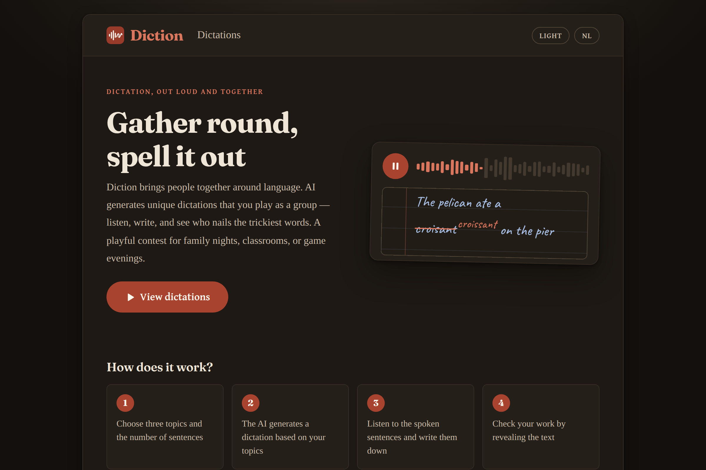
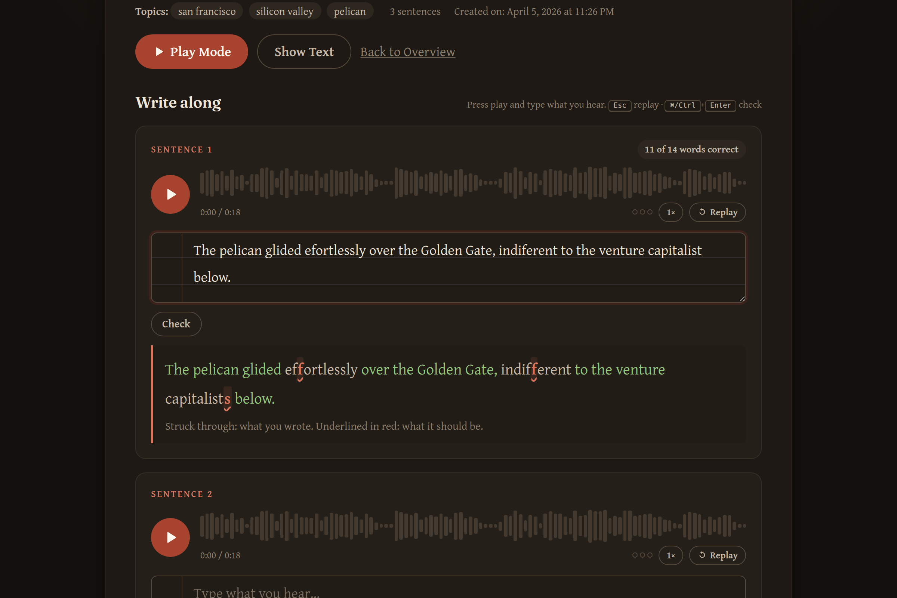
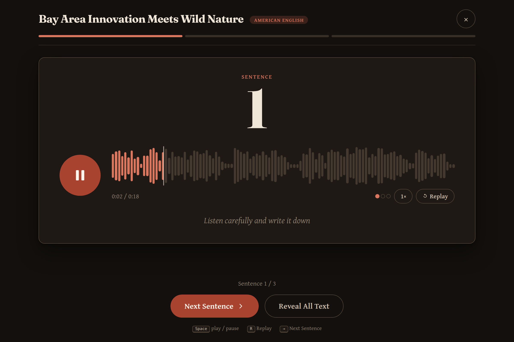
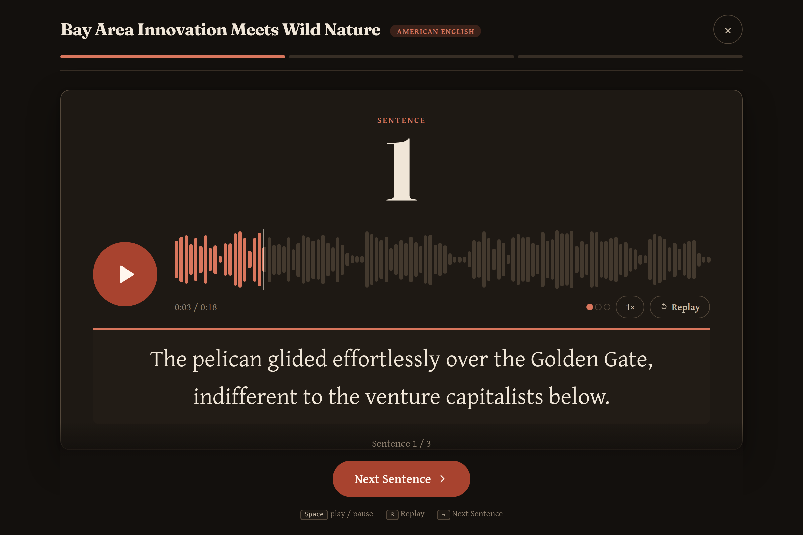

# Diction

Diction brings people together around language. AI generates unique dictations in Dutch or American English that you play as a group — listen, write, and see who nails the trickiest words. A playful contest for family nights, classrooms, or game evenings. Try it at [diction.vincentbruijn.nl](https://diction.vincentbruijn.nl/).

Inspired by the [Groot Dictee der Nederlandse Taal](https://dictees.nl/alle-dictees/groot-dictee-der-nederlandse-taal/).

## Features

- 🤖 AI-powered Dutch and American English dictation generation using Claude
- 🎙️ Text-to-speech with ElevenLabs
- 🌐 Multi-language UI (Dutch and American English) with cookie-based language switcher
- 🎯 AI-generated titles for each dictation
- 🎲 Group play mode — PIN-protected sequential playback optimized for projection on a shared screen
- 🔒 Passphrase gate and secret token protection for controlled access
- 🐳 Docker support for easy deployment
- 🛡️ Built-in security: input validation, XSS prevention, rate limiting

## Example

Listen to an AI-generated sentence:

<audio controls src="en-US-example-sentence.mp3">
  <a href="en-US-example-sentence.mp3">en-US-example-sentence.mp3</a>
</audio>

## Screenshots

| Home | Dictation detail |
|---|---|
|  |  |

| Play mode | Text revealed |
|---|---|
|  |  |

## Quick Start

### Option 1: Docker (Recommended)

See [DOCKER.md](DOCKER.md) for detailed instructions.

```bash
# 1. Configure environment
cp .env.docker.example .env.docker
# Edit .env.docker with your API keys

# 2. Run with Docker Compose
docker-compose --env-file .env.docker up -d

# 3. Access the app
open http://localhost:3000
```

### Option 2: Local Development

```bash
cd webapp

# 1. Install dependencies
npm install

# 2. Configure environment
cp .env.example .env
# Edit .env with your API keys

# 3. Generate secret token for /create access
npm run token:setup

# 4. Start the server
npm start
```

## Group Play Mode

Play mode turns a dictation into a communal activity — perfect for family gatherings, classrooms, or game nights.

### Setup

1. Go to `/create?token=YOUR_SECRET_TOKEN`
2. Fill in 3 topics, choose a language and sentence count
3. Enter a **4-6 digit PIN** in the PIN field — this enables play mode for the dictation
4. Click "Generate" and wait for the sentences and audio to be created

### Running the session

5. Connect the admin's device to a TV or projector
6. Open the dictation detail page and click the **"Play Mode"** link
7. Enter the PIN — you'll see the first sentence card with an audio player
8. Hand out pen and paper to all participants

### Playing

9. Press play on the audio for the current sentence — everyone writes along
10. Click **"Next Sentence"** to reveal the next card; repeat until all sentences have been played
11. When ready, click **"Reveal All Text"** (you'll be asked to confirm) — all sentences become visible so everyone can check their work

### Notes

- The PIN is stored per-dictation and remembered in a cookie for 24 hours, so you won't need to re-enter it if you refresh
- Dictations created without a PIN work exactly as before — no play mode link is shown
- The play view is a standalone page (no nav bar) designed for large-screen projection

## Passphrase Gate (Create Access)

As an alternative to the secret token, you can protect `/create` with a passphrase. This is useful when you want to share access without distributing a long URL token — for example, at a conference demo where you tell the audience the code verbally.

### Setup

Add `CREATE_PASSPHRASE` to your `.env` (or `.env.docker`):

```
CREATE_PASSPHRASE=yourpassphrase
```

### How it works

1. When a visitor opens `/create`, they see a passphrase entry form
2. After entering the correct passphrase, a hashed cookie is set for 24 hours
3. Subsequent visits to `/create` within that window skip the prompt

### Access priority

The create middleware checks access in this order:

1. **Cookie** — valid `create_access` cookie from a previous passphrase entry
2. **URL token** — `?token=` query parameter matching `CREATE_SECRET_TOKEN`
3. **Passphrase form** — shown if `CREATE_PASSPHRASE` is set
4. **403 Forbidden** — if neither passphrase nor token is configured

If neither `CREATE_PASSPHRASE` nor `CREATE_SECRET_TOKEN` is set, the create page is open to everyone.

## Secret Token (Create Access)

The `/create` route is protected by a secret token to prevent unauthorized dictation creation. Without a valid token, visitors get a 403 Forbidden page.

### Generating a token

From the `webapp/` directory:

```bash
# Generate a token and automatically save it to .env
npm run token:setup

# Or just print a token to stdout (doesn't save)
npm run token:generate
```

This creates a 64-character hex string and stores it as `CREATE_SECRET_TOKEN` in your `.env` file.

### Using the token

Once the token is set, access the create page by appending it as a query parameter:

```
http://localhost:3000/create?token=YOUR_SECRET_TOKEN
```

To see the full URL with your token filled in:

```bash
npm run token:url
```

The token is carried through the form submission via a hidden input field, so you only need to provide it once when loading the page.

### Notes

- If `CREATE_SECRET_TOKEN` is **not set** in `.env`, the `/create` route is unprotected (a warning is logged)
- For Docker deployments, set the token in `.env.docker` instead — see [DOCKER.md](DOCKER.md)

## Admin Access (Delete Protection)

Deleting dictations requires admin authentication. Without it, delete buttons are hidden and the delete endpoint is blocked.

### Setup

Add `ADMIN_SECRET` to your `.env` (or `.env.docker`):

```
ADMIN_SECRET=yoursecret
```

Or let `npm run token:setup` generate one automatically alongside the create token.

### How it works

1. Visit `/admin/login` and enter the admin secret
2. A SHA-256 hashed cookie is set for 7 days
3. Delete buttons appear on the dictation listing and detail pages
4. Logout via `/admin/logout`

If `ADMIN_SECRET` is not set, delete functionality is disabled for everyone.

## Documentation

- [DOCKER.md](DOCKER.md) - Docker deployment guide
- [webapp/.env.example](webapp/.env.example) - Environment configuration
- [webapp/scripts/](webapp/scripts/) - Token management utilities

## Security

This application includes:
- Secret token and passphrase authentication for creation endpoints
- Admin-only delete access with hashed cookie
- Input validation and sanitization
- XSS prevention (HTML escaping)
- Rate limiting
- CSRF protection via form tokens

## License

MIT